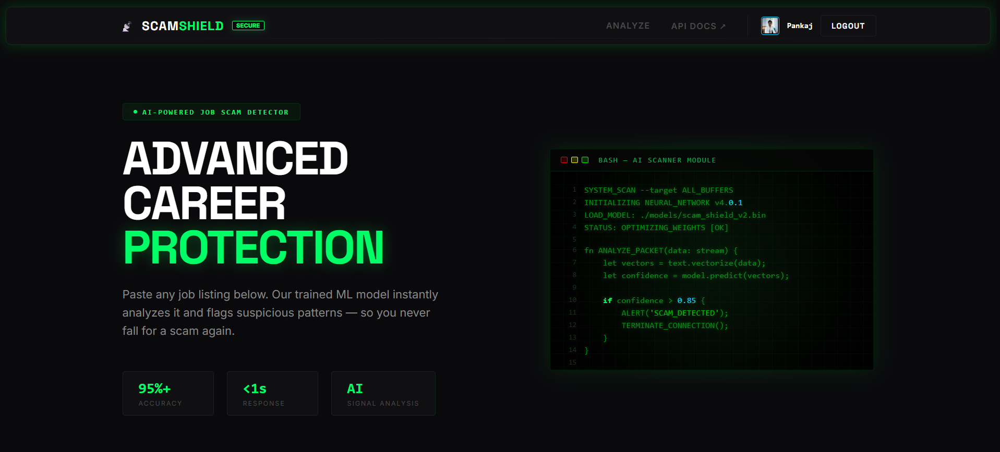
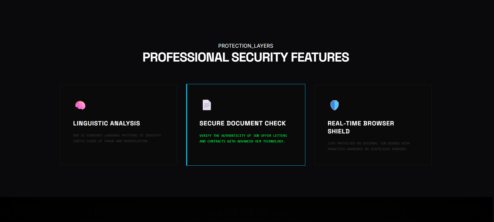
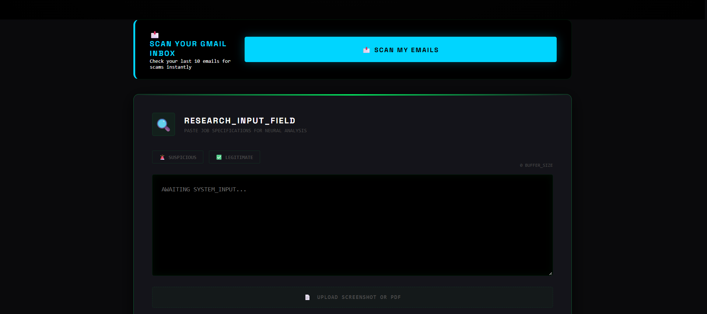
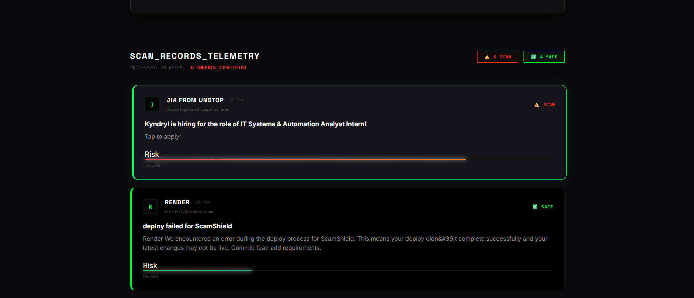

# ScamShield 🛡️



ScamShield is a modern, AI-powered full-stack application designed to proactively identify and flag fraudulent activities, with a specialized focus on fake job listings and malicious emails.

The platform utilizes machine learning to parse text, extract information from uploaded PDFs and images via OCR, and securely scan authentic Gmail inboxes for potentially harmful phishing attempts using a unified, user-friendly interface.

## 🌐 Live Deployment URLs
- **Frontend App:** [https://scam-shield-nine.vercel.app](https://scam-shield-nine.vercel.app)
- **Backend API:** [https://scamshield-xvcs.onrender.com](https://scamshield-xvcs.onrender.com)

---

## 🎯 Problem Statement
As digital platforms grow, cybercriminals have become highly sophisticated at exploiting them. Two of the most common and damaging vectors today are **fake job listings** and **spear-phishing emails**. 

Traditional spam filters often miss highly targeted, emotionally manipulative texts. Scammers post seemingly legitimate remote jobs on reputable platforms to harvest Social Security Numbers, exact banking details, or force victims into "advance-fee" hardware scams. Similarly, urgent "Account Suspended" emails continue to bypass basic heuristic filters. 

There is an urgent need for an intelligently trained, on-demand analytical tool that allows everyday people to instantly spot-check suspicious text and files before they become victims of identity theft or financial fraud.

## 👤 The End User
ScamShield is built for:
- **Job Seekers:** Actively browsing LinkedIn, Indeed, or remote job boards who want to verify the legitimacy of a recruiter's pitch or an off-platform job application PDF.
- **Everyday Internet Users:** Who receive suspicious notifications or urgent claims in their inbox and need a second "AI opinion" without having to forward the email anywhere.
- **Cybersecurity Enthusiasts:** Who want to understand exactly *why* a text is considered dangerous by analyzing the exact top-weighted machine learning signals.

## ⚙️ Working Flow

1. **Input Phase:** The user accesses the frontend interface and provides data via three methods:
   - Pasting text directly into the Cyber Terminal.
   - Uploading a Document/Screenshot (PDF, JPG, PNG).
   - Authenticating via Google OAuth to permit a temporary read of their Gmail inbox.
2. **Transmission:** The React frontend securely transmits this data (or the OAuth token) via Vercel's proxy to the Python FastAPI backend.
3. **Extraction & NLP:** If a file is uploaded, the backend uses `EasyOCR` (for images) or `pdfplumber` (for PDFs) to extract raw text. The text is then aggressively cleaned (stripping URLs, special characters, and converting to lowercase).
4. **AI Inference:** The cleaned text is converted into a vector matrix using a pre-trained `joblib` vectorizer. This vector is fed into highly optimized `scikit-learn` models (e.g., Logistic Regression).
5. **Signal Identification:** The model evaluates the probability of the text being a scam and mathematically isolates the exact keywords (Integrity Signals) that influenced its decision the most (e.g., "guaranteed", "wiring", "suspended").
6. **Result Visualization:** The backend returns a JSON payload containing the Verdict, a Confidence Score (%), and the specific Threat Signals. The frontend visually renders this data using a glassmorphic result card and an animated confidence ring.

---

## 🚀 Key Features
* **Google Inbox Scanning:** Secure Google OAuth 2.0 integration allows users to permissionlessly scan their last 10 received emails for scam/phishing indicators.
* **Smart Job Listing Analysis:** Copy-paste job descriptions into the terminal interface to cross-reference integrity signals against our SCAM/SAFE machine learning classifiers.
* **Document Upload & OCR:** Upload standard documents, screenshots (PNG, JPG), or PDFs natively. The engine uses `EasyOCR` and `pdfplumber` to extract text and analyze it in seconds.
* **Secure CORS Proxying:** End-to-end integration designed securely with Vercel API path rewrites to completely bypass complex CORS infrastructure.

## 🏗️ Architecture Stack
This repository is formatted as a monorepo consisting of three primary modules:

1. **`ScamShieldFrontend`**: A lightning-fast Single Page Application (SPA) built with React and Vite. It serves a glassmorphism "Cyber Terminal" UI.
2. **`ScamShieldBackend`**: A robust, asynchronous API driven by FastAPI and Python. It manages ML models (`scikit-learn`), Google API bindings, and computationally heavy OCR tasks.
3. **`ScamShieldExtension`**: A supplemental browser extension package designed to accompany the web infrastructure.

---

## 💻 Local Development Setup

### 1. ScamShield Backend (FastAPI)
The backend requires Python 3.12+ and uses a virtual environment.

```bash
cd ScamShieldBackend
# Create and activate a Virtual Environment
python -m venv venv
.\venv\Scripts\Activate  # On Windows

# Install the dependencies
pip install -r requirements.txt

# Start the Development Server
uvicorn app:app --reload
```
**Environment Variables (`ScamShieldBackend/.env`):**
You must configure a `.env` file with your Google Cloud Console credentials for OAuth to work locally:
```env
FRONTEND_URL=http://localhost:5173
GOOGLE_CLIENT_ID=your_google_client_id
GOOGLE_CLIENT_SECRET=your_google_client_secret
SESSION_SECRET_KEY=supersecretkey_change_me
```

### 2. ScamShield Frontend (React + Vite)
The frontend requires Node.js (v18+).

```bash
cd ScamShieldFrontend

# Install NPM dependencies
npm install

# Start the Vite development server
npm run dev
```

---

## ☁️ Deployment Instructions

This application is optimized for cloud deployment using **Vercel** and **Render**.

### Backend (Render)
1. Link your GitHub repository in your Render Dashboard and create a new **Web Service**.
2. **Build Command:** `pip install -r requirements.txt`
3. **Start Command:** `uvicorn app:app --host 0.0.0.0 --port $PORT`
4. Make sure to add the exact `FRONTEND_URL` to your Render Environment Variables once you know your deployed frontend URL (e.g. `https://scam-shield-nine.vercel.app`).

### Frontend (Vercel)
1. Import the repository into your Vercel Dashboard.
2. Important: Set the **Root Directory** setting to `ScamShieldFrontend`.
3. Vercel will automatically detect Vite and configure the `npm run build` step.
4. Open the `vercel.json` file to ensure the destination rewrite points directly to your deployed Render URL (e.g. `https://scamshield-xvcs.onrender.com/:path*`).
5. Deploy.

---

**Note on Google OAuth Deployment:**
In order for users to log in on your live Vercel URL, you must add both the `FRONTEND_URL` and `FRONTEND_URL/api/auth/callback` to the *Authorized JavaScript origins* and *Authorized redirect URIs* respectively inside the **Google Cloud Console**. When transitioning from the `Testing` phase, make sure to formally Publish your OAuth App so that external users can utilize the inbox scanner.


## 📸 Interface Preview
<p align="center">
  
</p>
<p align="center">
  
</p>
<p align="center">
  
</p>
<p align="center">
  
</p>
